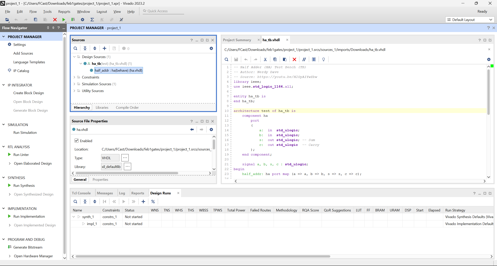
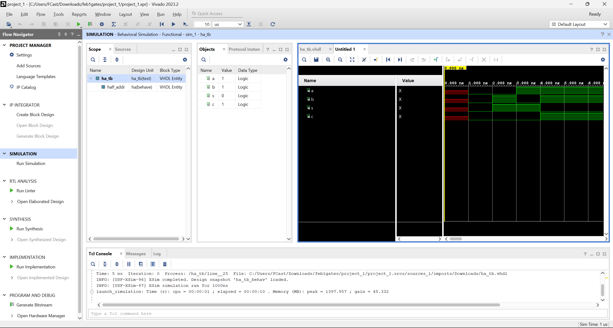
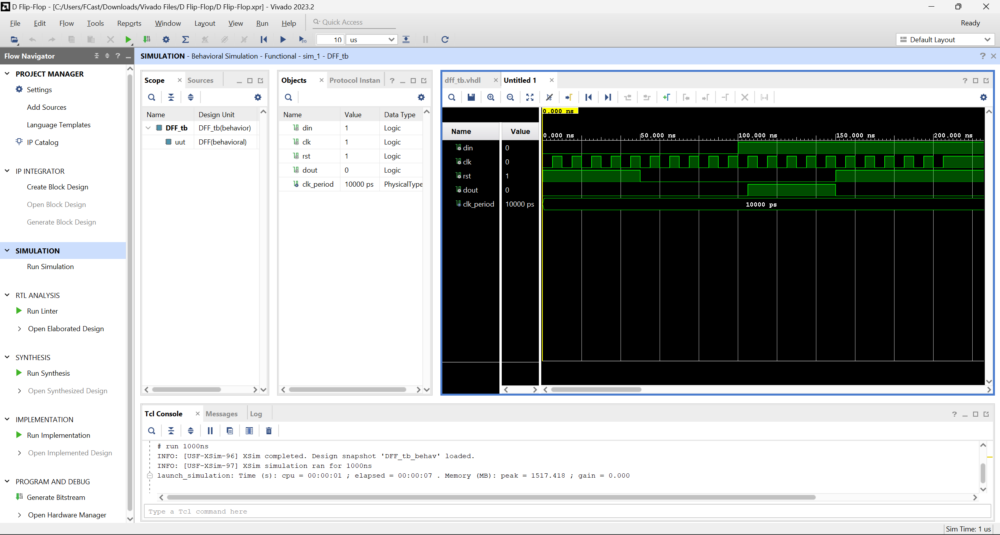
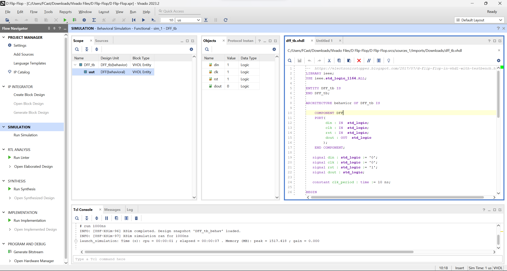

After studying GHDL and VHDL I installed the necessary files for this lab
- GHDL
- GTKWave
- Vivado (Coding software to run VHDL code)

After setting up Vivado for coding VHDL, I downloaded and imported the half-adder example to Vivado, this required the following files:
1. ha_tb.vhdl
2. ha.vhdl

It's necessary to have both files before running the simulation because these two work in tandom to create the half-adder simulation

After running the simuation we get the graph above, this represents the results of a half adder's output variables "" when it's input variables "" are under various combinations of "0" and "1"
Next, was running the D Flip-Flop example which requiredt the following files:
1. dff_tb.vhdl
2. dff.vhdl

