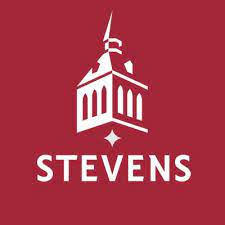

# Engineering Design VI Assignment 0
**Welcome to my GitHub page**
*This repository is at an early stage and is subject to change as the semester continues*
> **Welcome! My name is Frank Castillo and I am an electrical engineering major at Stevens Institute of Technology**
Three of my favorite hobbies (in order)
1. Playing video games
2. Going to the gym (weightlifting)
3. Watching TV shows
Some facts about me
- I am a first gen American and college student, my parents immigrated from Peru
- During COVID I learned a lot about computers and built one myself
- Since I was a kid, I always hoped to become an engineer
- Although I don't know much coding, I loved learning what I have and hope to expand my knowledge on it

Here's a simple C++ code that every coding student first learned
`cout << Hello World! << endl;`
---
[Link to Stevens website](https://www.stevens.edu)

